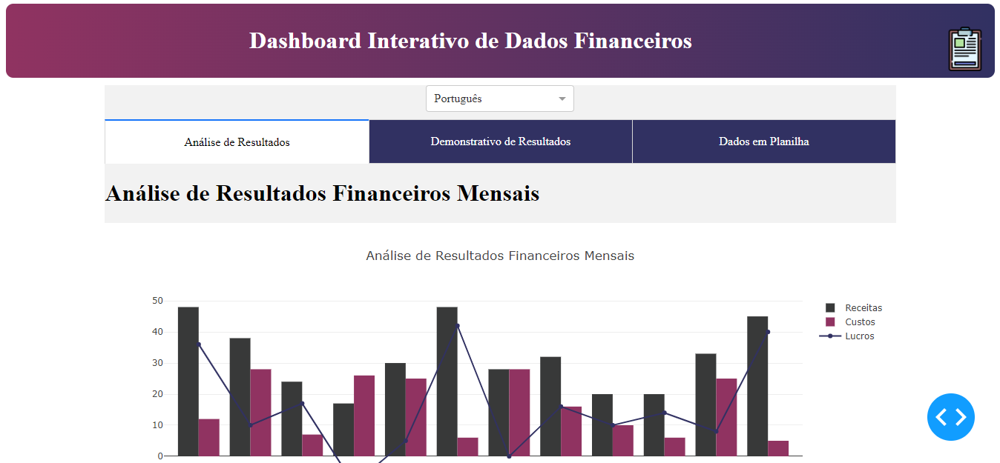

# Projeto Dash - Dashboard de Dados Financeiros



Análise de Resultados Financeiros Mensais

Este projeto oferece uma análise abrangente dos resultados financeiros mensais, destacando a evolução da receita e o nível de endividamento. Utilizando dados gerados aleatoriamente, o sistema apresenta um demonstrativo detalhado que inclui as seguintes métricas:

Resultado Final do Período 

Resultado Acumulado do Ano

Resultado Médio Mensal

Variação Média Anual

Além disso, os dados financeiros são organizados em uma planilha, permitindo uma visualização clara e eficiente dos resultados. 

Permite ver os dados em Português BR e Inglês.


## Projeto-Dash:
 financial_data.csv  # Arquivo CSV gerado com dados financeiros aleatórios
 
csv_ramdom.py         # Script para gerar o arquivo CSV

 exemplo.py                   # Script para criar o dashboard com Dash
 
requirements.txt         # Lista de dependências do projeto

 README.md                # Arquivo de documentação do projeto


## Requisitos

- Python 3.7 ou superior
- Bibliotecas listadas em `requirements.txt`

## Autora:
Este projeto foi criado por Camila Lemia.


1. Clone o repositório para o seu ambiente local:

```sh
git clone https://github.com/seu-usuario/projeto-dash.git
cd projeto-dash


